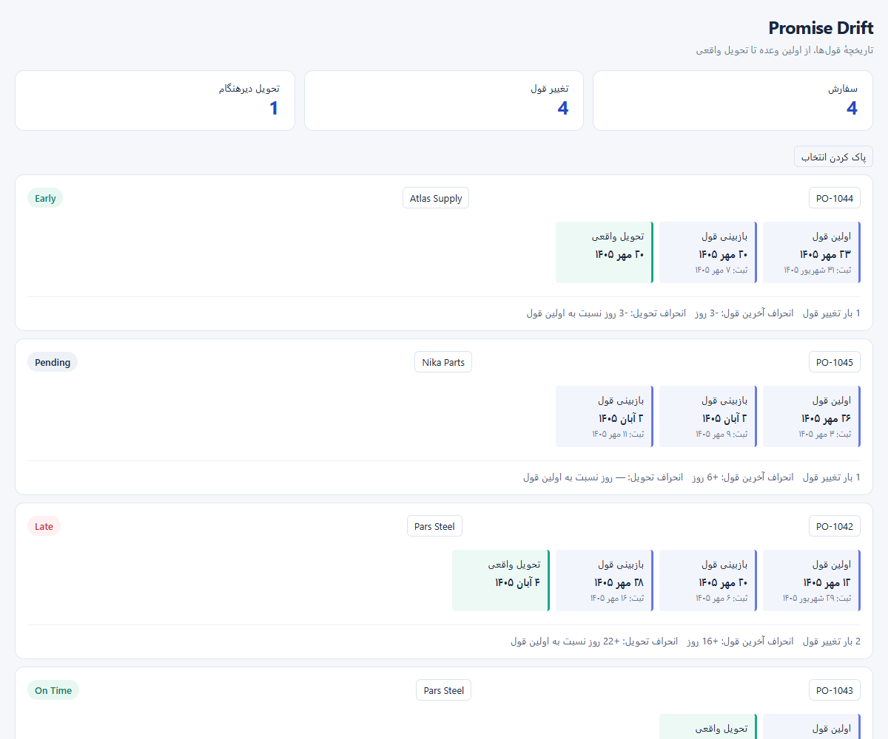

# Promise Drift

### Every promise has a history.

A Power BI custom visual that reveals how supplier delivery promises change over time—and compares actual delivery against the **first commitment**.

[Download the visual](downloads/Promise-Drift-1.0.1.pbiviz?raw=true) · [راهنمای فارسی](README.fa.md) · [Sample data](sample-data/promise-drift.csv) · [Test report](TEST-REPORT.md)



## Why Promise Drift?

A supplier can meet the latest promise while delivering weeks later than originally agreed. Promise Drift keeps the original commitment visible.

**First promise → revised promises → actual delivery**

For each purchase order and supplier, see:

- The chronological history of promised delivery dates.
- The number of actual date changes, excluding unchanged snapshots.
- Latest promise drift and actual delivery drift, measured in days against the first promise.
- **On Time**, **Late**, **Early**, or **Pending** status.
- Persian calendar display and independent right-to-left layout controls.
- Order and supplier selection through the Power BI Selection API.

## Install

1. [Download Promise-Drift-1.0.1.pbiviz](downloads/Promise-Drift-1.0.1.pbiviz?raw=true). If GitHub opens a file page, select **Download raw file**.
2. In Power BI, open the Visualizations menu and choose **Import a visual from a file**.
3. Select the downloaded package and add the visual to the report.
4. Connect the columns below. Use date columns directly, without Date Hierarchy.

| Data role | Required | Meaning |
|---|---|---|
| PO Number | Yes | Purchase order identifier |
| Supplier | Yes | Supplier name or identifier |
| Revision Date | Yes | Date the promise was recorded |
| Promised Date | Yes | Promised delivery date at that revision |
| Actual Delivery Date | No | Final delivery date |

Each row represents one promise snapshot. Input dates use native Date values or Gregorian ISO dates. Persian dates are a display option, not an input format.

## Try the example

Import [the sample CSV](sample-data/promise-drift.csv) and set the three date columns to Date.

| Order | Changes | Promise drift | Delivery drift | Status |
|---|---:|---:|---:|---|
| PO-1042 | 2 | +16 days | +22 days | Late |
| PO-1043 | 0 | 0 days | 0 days | On Time |
| PO-1044 | 1 | −3 days | −3 days | Early |
| PO-1045 | 1 | +6 days | — | Pending |

Click an order number to select its history. Click a supplier to select its loaded orders. Ctrl/Cmd enables multiple selection; **Clear selection** resets it. Configure effects on other visuals through Power BI's **Edit interactions**.

## Build

Requires Node.js 24 and npm.

```sh
npm install
npm test
npm run typecheck
npm run package
```

The SDK writes the installable package to `dist/`. Use `npm start` for local development.

The included package was built with Microsoft Power BI Visuals Tools 7.2.1. TypeScript validation, eight domain tests, and browser tests on the packaged code passed. **Import into Power BI Desktop/Service has not yet been tested.** See [verification details](TEST-REPORT.md).

## MVP scope

- Status is calculated against the first visible promise. Preserve the full revision history in report filters if you need the original baseline.
- Dates are compared as UTC calendar days; revisions with conflicting promises on the same day are flagged and excluded.
- Multiple distinct actual delivery dates are flagged; partial deliveries are not supported.
- The timeline shows event order; spacing does not represent elapsed days.
- Up to 30,000 snapshots are requested. A warning appears when Power BI indicates partial data.
- No external network privileges are requested. This package is not AppSource-certified.

## فارسی

**قول اول را فراموش نکنیم.** این ویژوال تاریخچهٔ تغییر قول تأمین‌کننده را برای هر سفارش نشان می‌دهد و تحویل واقعی را با اولین قول مقایسه می‌کند. نمایش شمسی، چیدمان راست‌به‌چپ و انتخاب سفارش/تأمین‌کننده پشتیبانی می‌شود.

[راهنمای کامل فارسی و تعریف محاسبات](README.fa.md)
